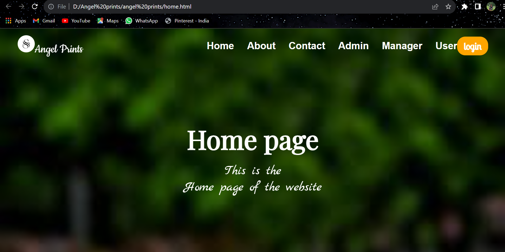

# Angel-prints
Angel Prints is an innovative online design web portal that allows users to create, customize, and print a wide variety of designs. 
From personalized greeting cards to professional business stationery, Angel Prints provides a seamless experience for all your design and printing needs.

Features:

User-Friendly Interface: Intuitive and easy-to-navigate design tools.
Design Customization: Wide range of customizable templates for different design needs.
Real-Time Preview: Instantly see changes and previews of your designs.
User Accounts: Create and manage user accounts for saving designs and order history.
Order Management: Efficient order processing and tracking system.
Responsive Design: Fully responsive interface that works on both desktop and mobile devices.
Secure Transactions: Secure handling of user data and transactions

Technologies Used:

Frontend:
HTML: Structure of the web pages.
CSS: Styling for a visually appealing interface.
JavaScript & jQuery: Interactive features and dynamic content management.
Backend:
Python: Server-side logic and functionality.
SQL: Database management for storing user data, designs, and orders.

Usage:

Open the application in your web browser.
Register for a new account or log in to your existing account.
Browse through various design templates and select the one you want to customize.
Use the design tools to personalize your template.
Preview your design in real-time.
Save your design and proceed to order prints.
Manage your orders and track their status from your account dashboard.

